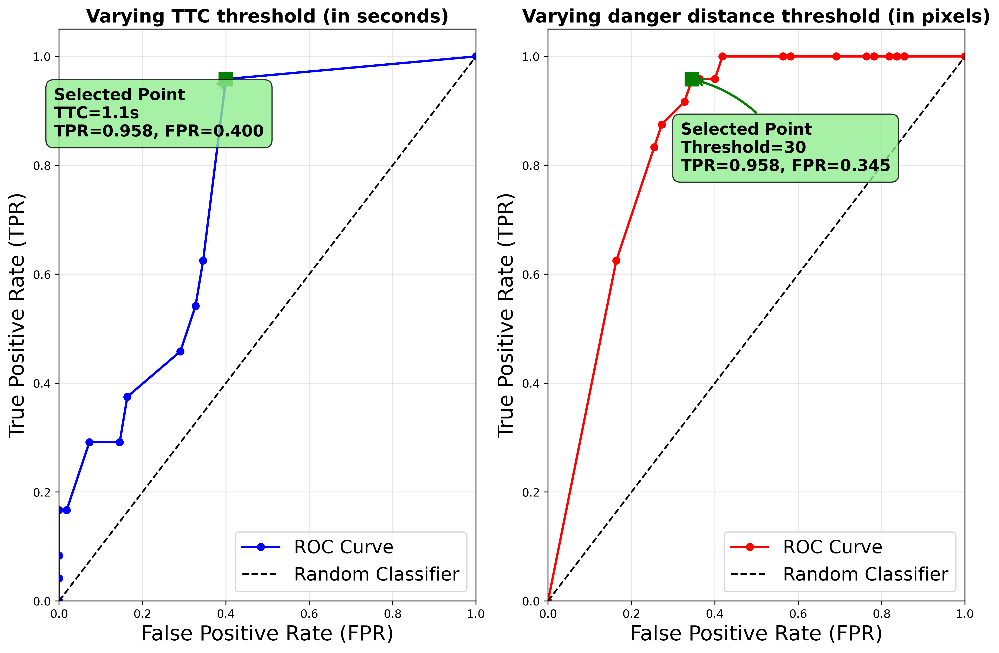

# MQTT Calibration - ROC Analysis

This repository contains Python scripts for evaluating collision prediction systems using Receiver Operating Characteristic (ROC) curve analysis. The project compares two different collision detection methods: **Distance-based** and **Time-to-Collision (TTC)** based approaches.

## Overview

The project simulates pedestrian-vehicle interactions by:
1. Reading MQTT messages containing vehicle detection data and trajectories
2. Generating virtual pedestrians with predefined trajectories
3. Evaluating collision prediction performance using confusion matrices
4. Generating ROC curves to compare different threshold configurations

## Files Description

### `dd-roc-auc.py`
Generates confusion matrices for **distance-based** collision prediction. This script:
- Tests danger distance thresholds from 10 to 200 pixels (in steps of 5)
- Uses a fixed ground truth threshold of 50 pixels to determine actual collisions
- Varies the prediction threshold to generate ROC curve data points
- Saves confusion matrices to `dd_confusion_matrices.npy`

**Usage:**
```bash
python dd-roc-auc.py
```

**Output:**
- `dd_confusion_matrices.npy`: NumPy array containing confusion matrices for all tested thresholds

### `TTC-roc-auc.py`
Generates confusion matrices for **Time-to-Collision (TTC)** based collision prediction. This script:
- Tests TTC thresholds from 1 to 12 steps (equivalent to 0.1 to 1.2 seconds)
- Uses a fixed TTC look-ahead of 12 steps
- Varies the TTC threshold to determine when warnings should be issued (only warnings for collisions within the threshold are considered)
- Saves confusion matrices to `ttc_threshold_confusion_matrices.npy`

**Usage:**
```bash
python TTC-roc-auc.py
```

**Output:**
- `ttc_threshold_confusion_matrices.npy`: NumPy array containing confusion matrices for all tested TTC thresholds

### `combined_roc_figure.py`
Generates side-by-side ROC curves comparing both methods. This script:
- Loads the saved confusion matrices from both analysis scripts
- Calculates True Positive Rate (TPR) and False Positive Rate (FPR) for each threshold
- Plots two ROC curves side-by-side for visual comparison
- Calculates and displays Area Under the Curve (AUC) scores for both methods
- Highlights selected optimal threshold points

**Usage:**
```bash
python combined_roc_figure.py
```

**Prerequisites:**
- Must run `dd-roc-auc.py` and `TTC-roc-auc.py` first to generate the required `.npy` files

**Output:**
- `combined_roc_figure.png`: High-resolution (400 DPI) figure showing both ROC curves



## Data Files

### `mqtt_messages.txt`
Input file containing MQTT messages with vehicle detection data. Each message should contain:
- `boxes`: Bounding boxes for detected objects
- `labels`: Object labels (vehicles are identified by "vehicle" in the label)
- `traj_tjs`: Trajectory points for tracked objects
- `traj_id`: IDs associated with trajectories
- `ids`: IDs associated with detected objects

### Generated Files
- `dd_confusion_matrices.npy`: Confusion matrices for distance-based analysis
- `ttc_threshold_confusion_matrices.npy`: Confusion matrices for TTC-based analysis
- `combined_roc_figure.png`: Combined ROC curve visualization

## Workflow

1. **Prepare your data**: Ensure `mqtt_messages.txt` is in the project directory
2. **Run distance-based analysis**: Execute `dd-roc-auc.py` to generate distance threshold confusion matrices
3. **Run TTC-based analysis**: Execute `TTC-roc-auc.py` to generate TTC threshold confusion matrices
4. **Generate visualization**: Execute `combined_roc_figure.py` to create the combined ROC curve figure

## Requirements

See `requirements.txt` for the list of Python packages required.

## Notes

- Both analysis scripts use a fixed random seed (42) for reproducible results
- The ground truth collision detection uses a fixed threshold of 50 pixels
- Pedestrians are generated with trajectories between predefined fixed points (A, B, C, D)
- The simulation processes MQTT messages in real-time and tracks pedestrian-vehicle interactions

